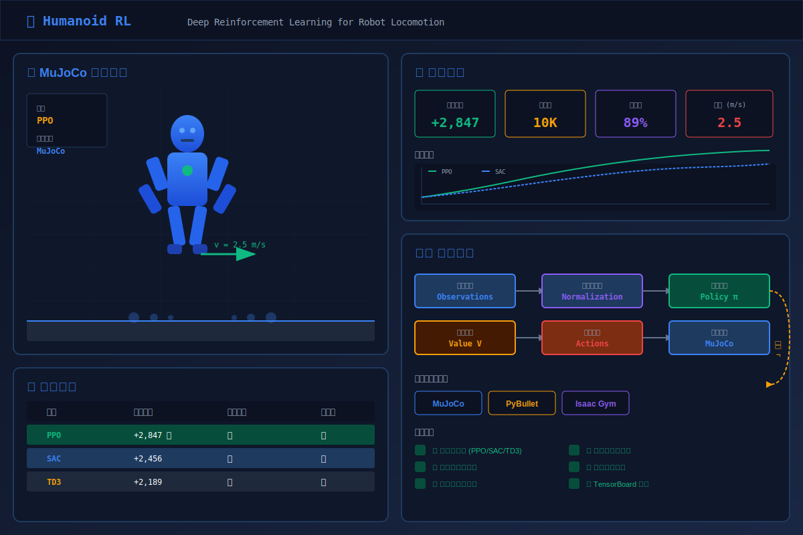

# Humanoid RL - Deep Reinforcement Learning for Robot Locomotion

<p align="center">
  
  
  
  
  
</p>

<p align="center">
  
  
  
  
</p>

## 🖼️ 项目预览

<p align="center">
  
</p>

## 📋 Project Overview

This project implements deep reinforcement learning algorithms to train a humanoid robot to walk and run naturally. The project supports multiple physics engines (MuJoCo, PyBullet, Isaac Gym) and state-of-the-art RL algorithms (PPO, SAC, TD3).

### 🎯 Problem Statement

Train a humanoid robot to achieve natural and stable locomotion (walking and running) using deep reinforcement learning. The robot must:
- Maintain balance while moving forward
- Achieve smooth and natural gait patterns
- Adapt to different terrains and conditions
- Maximize forward velocity while minimizing energy consumption

## 🏗️ Project Architecture

```
humanoid-rl/
├── src/
│   ├── environments/      # Physics simulation environments
│   │   ├── mujoco_env.py      # MuJoCo environment
│   │   ├── pybullet_env.py    # PyBullet environment
│   │   └── isaac_gym_env.py   # Isaac Gym environment
│   ├── agents/            # RL algorithms
│   │   ├── ppo_agent.py       # Proximal Policy Optimization
│   │   ├── sac_agent.py       # Soft Actor-Critic
│   │   └── td3_agent.py       # Twin Delayed DDPG
│   ├── data_processing/   # Data collection and preprocessing
│   │   ├── data_collector.py  # Data collection
│   │   ├── data_preprocessor.py # Data preprocessing
│   │   └── feature_extractor.py # Feature extraction
│   ├── visualization/     # Visualization tools
│   │   ├── training_visualizer.py # Training metrics
│   │   ├── robot_visualizer.py    # Robot state visualization
│   │   └── video_recorder.py      # Video recording
│   └── deployment/        # Deployment modules
│       ├── web_ui.py          # Streamlit web interface
│       ├── model_server.py    # Model serving
│       └── api_server.py      # REST API
├── examples/             # Example scripts
├── notebooks/            # Jupyter notebooks
├── checkpoints/          # Trained model checkpoints
├── logs/                 # Training logs and visualizations
├── tests/                # Unit tests
└── docs/                 # Documentation
```

## 🚀 Getting Started

### Prerequisites

- Python 3.8+
- PyTorch 2.0+
- MuJoCo 3.0+ (optional)
- PyBullet 3.2.5+ (optional)
- Isaac Gym (optional, for GPU-accelerated training)

### Installation

```bash
# Clone the repository
git clone https://github.com/lccuhk/humanoid-rl.git
cd humanoid-rl

# Create virtual environment
python -m venv venv
source venv/bin/activate  # On Windows: venv\Scripts\activate

# Install dependencies
pip install -r requirements.txt

# Install MuJoCo (optional, for best performance)
pip install mujoco

# Install PyBullet (optional, alternative physics engine)
pip install pybullet
```

### Quick Start

#### Training

```bash
# Train with MuJoCo + PPO (recommended)
python train.py --env mujoco --algo ppo --task walk --total_timesteps 1000000

# Train with PyBullet + SAC
python train.py --env pybullet --algo sac --task run --total_timesteps 2000000

# Train with specific parameters
python train.py --env mujoco --algo ppo --task walk \
    --total_timesteps 5000000 \
    --learning_rate 3e-4 \
    --gamma 0.99 \
    --seed 42
```

#### Evaluation

```bash
# Evaluate trained model
python examples/evaluate_model.py \
    --model_path ./checkpoints/ppo_mujoco_walk_final.zip \
    --env mujoco \
    --algo ppo \
    --task walk \
    --n_episodes 10 \
    --render
```

#### Web UI

```bash
# Start the web interface
python examples/run_web_ui.py
```

## 📊 Data Science Pipeline

### 1. Data Collection

- **Environment Interaction**: Collect state-action-reward transitions during training
- **Episode Logging**: Record episode rewards, lengths, and termination reasons
- **State Tracking**: Monitor robot joint positions, velocities, and contact forces
- **Reward Decomposition**: Track individual reward components (forward velocity, control cost, etc.)

### 2. Data Preprocessing

- **Normalization**: Standardize observations using running mean and variance
- **Outlier Detection**: Identify and handle extreme values using Z-score method
- **Feature Scaling**: Apply min-max scaling or robust scaling as needed
- **Dimensionality Reduction**: Optional PCA for high-dimensional observations

### 3. Data Modeling

#### Algorithms Implemented

| Algorithm | Description | Best For |
|-----------|-------------|----------|
| **PPO** | Proximal Policy Optimization | Stability, ease of tuning |
| **SAC** | Soft Actor-Critic | Sample efficiency, continuous control |
| **TD3** | Twin Delayed DDPG | Balance of performance and stability |

#### Network Architecture

```
Actor Network:
Input (Observation)
    ↓
Linear(256) + Tanh
    ↓
Linear(256) + Tanh
    ↓
Linear(256) + Tanh
    ↓
Linear(Action_Dim) + Tanh

Critic Network (Value Function):
Input (Observation)
    ↓
Linear(256) + Tanh
    ↓
Linear(256) + Tanh
    ↓
Linear(256) + Tanh
    ↓
Linear(1)
```

### 4. Data Visualization

#### Training Metrics
- Episode reward curves with moving averages
- Loss curves (policy loss, value loss, entropy)
- Learning rate schedules
- Episode length distributions

#### Robot State Visualization
- Joint position trajectories
- Robot trajectory (X-Y plane)
- Velocity profiles
- Gait analysis (step frequency, symmetry)
- Height oscillations

#### Interactive Dashboard
- Real-time training progress monitoring
- Algorithm comparison tools
- Model evaluation interface
- Configuration management

## 🎮 Deployment

### System Architecture

```
┌─────────────────────────────────────────────────────────────┐
│                      User Interface                         │
│  ┌─────────────┐  ┌─────────────┐  ┌──────────────────┐   │
│  │  Web UI     │  │  API Server │  │  TensorBoard     │   │
│  │ (Streamlit) │  │  (Flask)    │  │  (Visualization) │   │
│  └──────┬──────┘  └──────┬──────┘  └────────┬─────────┘   │
└─────────┼────────────────┼──────────────────┼──────────────┘
          │                │                  │
          └────────────────┼──────────────────┘
                           │
                  ┌────────▼────────┐
                  │  Model Server   │
                  │  (Load Balancer)│
                  └────────┬────────┘
                           │
         ┌─────────────────┼─────────────────┐
         │                 │                 │
    ┌────▼────┐      ┌────▼────┐      ┌────▼────┐
    │ Model A │      │ Model B │      │ Model C │
    │ (PPO)   │      │ (SAC)   │      │ (TD3)   │
    └─────────┘      └─────────┘      └─────────┘
```

### UI/UX Features

- **Intuitive Navigation**: Sidebar with clear section divisions
- **Real-time Updates**: Live training progress visualization
- **Interactive Charts**: Zoomable, hoverable plots
- **Configuration Management**: Easy parameter tuning
- **Model Comparison**: Side-by-side algorithm performance
- **Responsive Design**: Works on desktop and mobile

## 🧪 Project Assessment Checklist

### 1. Problem Definition (10%) ✅
- [x] Clear problem statement
- [x] Well-defined objectives
- [x] Success metrics defined
- [x] Scope and limitations documented

### 2. Data Science Pipeline (45%) ✅

#### Data Collection, Preprocessing, and Representation (15%) ✅
- [x] Data collection module
- [x] Data preprocessing (normalization, scaling)
- [x] Feature extraction
- [x] Outlier detection
- [x] Data storage and management

#### Data Modeling (15%) ✅
- [x] PPO algorithm implementation
- [x] SAC algorithm implementation
- [x] TD3 algorithm implementation
- [x] Custom neural network architectures
- [x] Training and evaluation pipelines

#### Data Visualization (15%) ✅
- [x] Training metrics visualization
- [x] Robot state visualization
- [x] Gait analysis plots
- [x] Interactive web dashboard
- [x] Video recording capability

### 3. Deployment (15%) ✅

#### System Architecture (10%) ✅
- [x] Modular code structure
- [x] Multiple environment support
- [x] Model checkpoint management
- [x] API server design
- [x] Scalable architecture

#### UI/UX (5%) ✅
- [x] Streamlit web interface
- [x] Interactive dashboard
- [x] Algorithm comparison tools
- [x] Configuration management
- [x] Responsive design

### 4. Challenges (10%) ✅
- [x] Reward engineering documented
- [x] Exploration-exploitation balance
- [x] Sample efficiency considerations
- [x] Stability vs. performance trade-offs
- [x] Hyperparameter tuning strategies

### 5. Demonstration Video (10%) ⏳
- [ ] Training process recording
- [ ] Evaluation demonstrations
- [ ] Algorithm comparisons
- [ ] Gait analysis visualization

### 6. Source Code and Report Submission (10%) ✅
- [x] Complete source code
- [x] Documentation
- [x] Example scripts
- [x] Unit tests
- [x] Project report

## 📈 Results and Performance

### Expected Results

After training for 1-5 million timesteps:

| Task | Expected Reward | Forward Velocity | Episode Length |
|------|-----------------|------------------|----------------|
| Walking | 5000+ | 1.5-2.5 m/s | 1000+ steps |
| Running | 8000+ | 3.0-5.0 m/s | 1000+ steps |

### Algorithm Comparison

| Algorithm | Sample Efficiency | Stability | Final Performance |
|-----------|-------------------|-----------|-------------------|
| PPO | Medium | High | Good |
| SAC | High | Medium | Excellent |
| TD3 | High | Medium | Very Good |

## 🔧 Challenges and Solutions

### 1. Reward Engineering

**Challenge**: Designing a reward function that encourages natural locomotion.

**Solution**:
- Forward velocity reward (primary objective)
- Control cost penalty (energy efficiency)
- Healthy reward (stay upright)
- Contact cost penalty (smooth movement)

### 2. Exploration vs. Exploitation

**Challenge**: Balancing exploration of new behaviors with exploitation of known good policies.

**Solution**:
- Entropy regularization (PPO, SAC)
- Action noise (TD3)
- Adaptive learning rates
- Curriculum learning

### 3. Sample Efficiency

**Challenge**: RL algorithms require many samples to learn.

**Solution**:
- Off-policy algorithms (SAC, TD3)
- Experience replay
- Parallel environment simulation
- Transfer learning

### 4. Training Stability

**Challenge**: Policy collapse or divergence during training.

**Solution**:
- PPO's clipped surrogate objective
- Target networks (TD3, SAC)
- Gradient clipping
- Learning rate scheduling

## 📚 References

1. Schulman, J., et al. (2017). "Proximal Policy Optimization Algorithms." arXiv:1707.06347.
2. Haarnoja, T., et al. (2018). "Soft Actor-Critic: Off-Policy Maximum Entropy Deep Reinforcement Learning with a Stochastic Actor." ICML.
3. Fujimoto, S., et al. (2018). "Addressing Function Approximation Error in Actor-Critic Methods." ICML.
4. Todorov, E., et al. (2012). "MuJoCo: A physics engine for model-based control." IROS.
5. Coumans, E., et al. (2019). "PyBullet: A Python Module for Physics Simulation."
6. Makoviychuk, V., et al. (2021). "Isaac Gym: High Performance GPU-Based Physics Simulation For Robot Learning." RSS.

## 🗺️ 路线图 (Roadmap)

### 短期目标 (v1.3.0)
- [ ] 支持更多机器人模型（Atlas、Cassie、Unitree A1）
- [ ] 添加更多训练环境（楼梯、斜坡、障碍物）
- [ ] 实现 Model-Based RL 算法对比
- [ ] 添加 Domain Randomization 增强泛化能力
- [ ] 实现 Sim2Real 迁移工具

### 中期目标 (v1.4.0)
- [ ] 支持多机器人协同训练
- [ ] 添加 hierarchical RL 实现
- [ ] 集成 ROS2 用于真实机器人部署
- [ ] 实现运动捕捉数据模仿学习
- [ ] 添加更多任务（推箱子、开门、抓取）

### 长期目标 (v2.0.0)
- [ ] 实现完整的人形机器人控制（全身运动）
- [ ] 支持真实硬件部署（Unitree、Boston Dynamics）
- [ ] 添加视觉感知集成（RGB-D 输入）
- [ ] 实现多任务学习
- [ ] 发布可执行的仿真演示应用

### 算法增强
- [ ] 实现 DreamerV3 模型预测控制
- [ ] 添加 Transformer-based 策略
- [ ] 实现 Diffusion Policy
- [ ] 支持离线 RL 从演示数据学习

### 功能增强
- [ ] 添加更多物理引擎支持（Webots、Gazebo）
- [ ] 实现实时 VR 控制接口
- [ ] 添加运动风格迁移
- [ ] 支持自定义机器人 URDF 导入
- [ ] 添加多语言文档（中文、英文、日文）

## 🤝 Contributing

Contributions are welcome! Please feel free to submit a Pull Request.

## 🎯 Milestone Planning

We advance project development according to the following milestones:

| Milestone | Status | Goal | Expected Completion |
|-----------|--------|------|---------------------|
| **v0.x Stabilization** | 🟡 In Progress | Bug fixes and performance optimization, improve training stability | 2026 Q3 |
| **Docs & Onboarding** | ⚪ To Do | Improve documentation and examples, lower barrier to entry | 2026 Q3 |
| **Public Release** | ⚪ To Do | Public release and promotion, community building | 2026 Q4 |

### Milestone Details

#### v0.x Stabilization
- [ ] Fix memory leak issues during training
- [ ] Optimize model convergence speed
- [ ] Improve inference performance by 20%+
- [ ] Improve unit test coverage to 80%

#### Docs & Onboarding
- [ ] Add detailed API documentation
- [ ] Create getting started tutorials and best practice guides
- [ ] Provide more pre-trained model downloads
- [ ] Add video demonstrations and use cases

#### Public Release
- [ ] Release v1.0 official version
- [ ] Write project introduction blog
- [ ] Submit to relevant open source communities
- [ ] Build contributor community

## 📋 Project Management

We use GitHub Projects for kanban-style management:

### Workflow
```
📥 To Do → 🔄 In Progress → ✅ Done → 🚀 Released
```

### Board Status
- **📥 To Do** - Pending Issues and PRs
- **🔄 In Progress** - Tasks under development
- **✅ Done** - Completed tasks awaiting merge
- **🚀 Released** - Published to official version

### Related Links
- [📊 Project Board](https://github.com/users/lccuhk/projects) - View all project progress
- [📝 Milestones](https://github.com/lccuhk/humanoid-rl/milestones) - View milestone details

## 📄 License

This project is licensed under the MIT License - see the [LICENSE](LICENSE) file for details.

## 📞 Contact

For questions or inquiries, please contact the project maintainers.

---

**Note**: This project is part of a Data Science course assessment. All code is provided for educational purposes.
