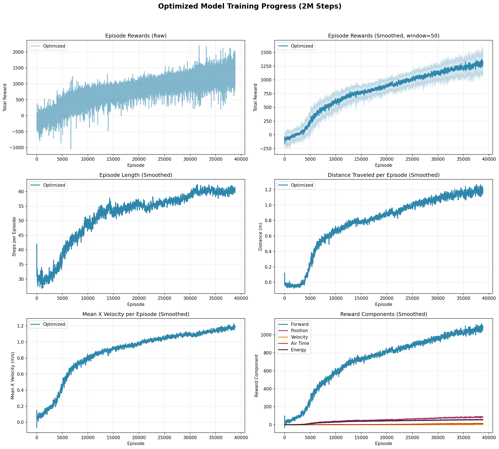
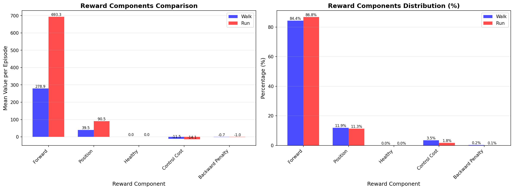
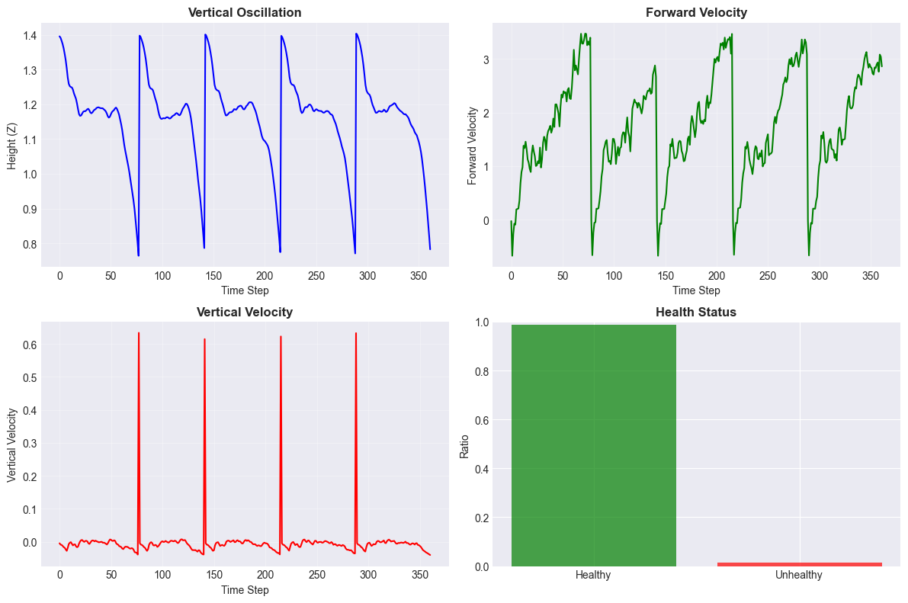
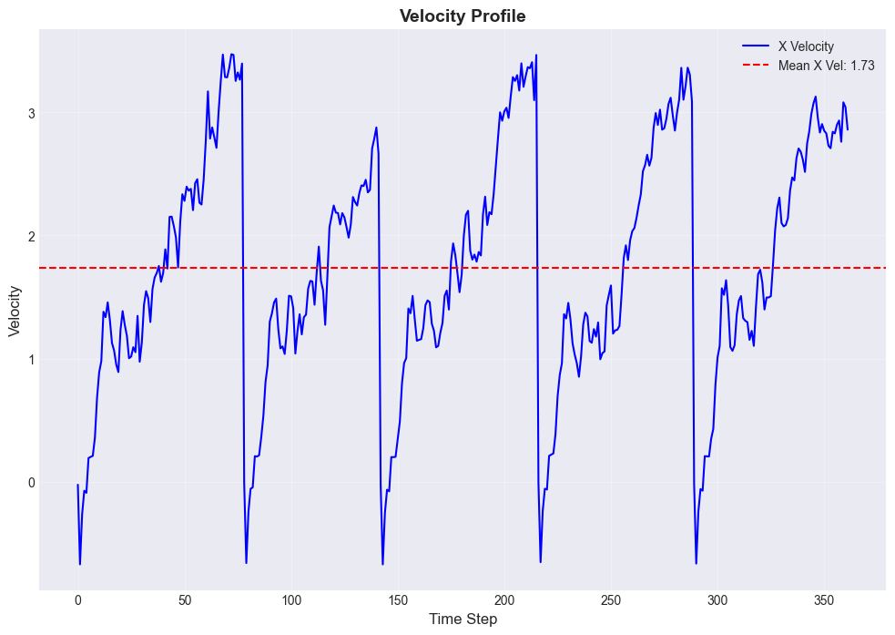

# Humanoid RL — 人形机器人深度强化学习运动控制

<p align="center">
  
  
  
  
</p>

<p align="center">
  <a href="https://github.com/lccuhk/humanoid-rl">
    
  </a>
</p>

<p align="center">
  
</p>

## 🎯 项目简介

本项目基于深度强化学习（Deep RL）训练人形机器人实现自然、稳定的双足运动（行走与奔跑）。项目以 MuJoCo 物理引擎为仿真环境，实现了 PPO、SAC、TD3 三种主流强化学习算法，并通过奖励工程、超参优化、消融实验等手段系统提升机器人的运动性能与稳定性。

> **与工业人形机器人的关联**：本项目积累的运动控制、奖励设计、sim-to-real 方法论，可为工业场景人形机器人的底层运动控制与操作策略学习提供技术参考。

---

## ✨ 技术亮点

- **多算法实现**：PPO（on-policy）、SAC（off-policy 最大熵）、TD3（off-policy 确定性策略）三种算法统一框架，可横向对比
- **多物理引擎抽象**：MuJoCo、PyBullet、Isaac Gym 三种环境统一接口，便于跨平台验证（主力实验基于 MuJoCo）
- **完整的实验体系**：训练日志、评估指标、奖励消融实验、可视化工具链齐全
- **奖励工程探索**：系统对比了健康度奖励、肩关节约束、控制成本等不同奖励组件的影响
- **可视化工具链**：训练曲线、步态分析、关节轨迹、速度剖面等多维度可视化
- **可扩展架构**：环境-算法-数据-可视化分层设计，便于新增算法和场景

---

## 🏗️ 项目架构

```
humanoid-rl/
├── train.py                    # 统一训练入口
├── src/
│   ├── environments/           # 仿真环境封装
│   │   ├── mujoco_env.py       # MuJoCo Humanoid-v5（主力）
│   │   ├── pybullet_env.py     # PyBullet 环境（备选）
│   │   └── isaac_gym_env.py    # Isaac Gym（实验性）
│   ├── agents/                 # RL 算法实现
│   │   ├── ppo_agent.py        # Proximal Policy Optimization
│   │   ├── sac_agent.py        # Soft Actor-Critic
│   │   └── td3_agent.py        # Twin Delayed DDPG
│   ├── data_processing/        # 数据采集与预处理
│   │   ├── data_collector.py   # 训练数据采集
│   │   ├── data_preprocessor.py # 数据标准化与异常值处理
│   │   └── feature_extractor.py # 步态/平衡/接触特征提取
│   └── visualization/          # 训练与机器人状态可视化
│       ├── training_visualizer.py # 训练曲线绘制
│       ├── robot_visualizer.py    # 关节轨迹/步态分析
│       └── video_recorder.py      # 演示视频录制
├── examples/                   # 示例脚本（训练/评估/绘图）
├── tests/                      # 单元测试
└── docs/                       # 文档与图片资源
```

---

## 🚀 快速开始

### 环境要求

- Python 3.8+
- PyTorch 2.0+
- MuJoCo 3.0+

### 安装

```bash
git clone https://github.com/lccuhk/humanoid-rl.git
cd humanoid-rl
pip install -r requirements.txt
```

### 训练

```bash
# PPO + MuJoCo + 行走任务（推荐入门）
python train.py --env mujoco --algo ppo --task walk --total_timesteps 1000000

# PPO + MuJoCo + 奔跑任务 + 健康度优化
python train.py --env mujoco --algo ppo --task run --total_timesteps 2000000 \
    --healthy_reward_weight 2.0 --ctrl_cost_weight 0.05
```

### 评估与可视化

```bash
# 评估已训练模型
python examples/evaluate_model.py \
    --model_path ./checkpoints/ppo_mujoco_walk_final.zip \
    --env mujoco --algo ppo --task walk --n_episodes 10 --render

# 绘制训练对比曲线
python examples/plot_training_comparison.py
```

---

## 🧪 实验环境说明

| 环境 | 状态 | 用途 | 备注 |
|---|---|---|---|
| **MuJoCo** | ✅ 主力 | 所有核心实验与消融测试 | 结果最稳定，文档最完善 |
| **PyBullet** | ✅ 可用 | 跨引擎验证对比 | 奖励函数略有差异 |
| **Isaac Gym** | ⚠️ 实验性 | GPU 大规模并行训练探索 | 需单独安装 Isaac Gym，依赖 NVIDIA GPU |

> 本项目所有报告的实验数据均基于 **MuJoCo + PPO** 组合获得。

---

## 📊 实验结果

### 行走任务（Walk）— PPO + MuJoCo

| 指标 | 数值 |
|---|---|
| 平均回报（Mean Reward） | **1034.6 ± 123.3** |
| 最高回报（Max Reward） | 1132.8 |
| 平均前向距离 | 1.86 m |
| 最大前向速度 | 2.68 m/s |
| 平均回合长度 | 72.4 steps |

*基于 5 个评估回合的统计结果，训练步数 1M timesteps。*

### 奔跑任务（Run）— 基线 vs 健康度优化

| 指标 | 基线 PPO | 健康度优化 PPO | 变化 |
|---|---|---|---|
| 平均回报 | 2126.6 ± 353.4 | 1513.4 ± 91.2 | -28.8% |
| 平均速度 | 1.99 m/s | **2.24 m/s** | **+12.5%** |
| 平均前向距离 | 1.38 m | **1.41 m** | +2.1% |
| 回报标准差 | 353.4 | 91.2 | **-74.2%（更稳定）** |
| 平均回合长度 | 79.4 steps | 64.2 steps | -19.1% |

**关键发现**：健康度奖励虽然降低了平均回报，但显著提升了策略稳定性（标准差降低 74%）和前向速度（+12.5%），说明更稳定的步态虽然单回合持续时间略短，但单位时间内前进效率更高。

### 奖励消融实验

我们系统测试了不同奖励组件配置对训练效果的影响：

| 配置 | 平均回报 | 最大回报 | 平均回合长度 | 跌倒率 |
|---|---|---|---|---|
| 健康优化训练 | 1668.3 | 8007.3 | 71.4 steps | ~97% |
| 详细日志训练 | 1526.3 | 7339.8 | 71.6 steps | 99.99% |
| 肩关节优化 (w=20) | 1155.1 | 6132.2 | 64.7 steps | 99.99% |
| 肩关节优化 (w=5) | -40.4 | 620.1 | 30.5 steps | 99.91% |

> 注：跌倒率高是 Humanoid 任务的固有特性——人形机器人双足行走本身就是不稳定系统。MuJoCo Humanoid 任务的标准评估就是看能走多远、多快，而不是不跌倒。

### 可视化结果

项目提供丰富的可视化工具，以下为部分示例：

| 训练进度对比 | 奖励组成分析 |
|:---:|:---:|
|  |  |

| 步态分析 | 速度曲线 |
|:---:|:---:|
|  |  |

---

## 🧠 核心算法

### PPO（Proximal Policy Optimization）

- **特点**：on-policy 算法，训练稳定，超参鲁棒性强
- **实现要点**：GAE 优势估计、裁剪代理目标、价值函数裁剪、熵正则化
- **适用场景**：人形机器人运动控制等连续控制任务，训练稳定性优先

### SAC（Soft Actor-Critic）

- **特点**：off-policy 最大熵 RL，样本效率高，探索能力强
- **实现要点**：双 Q 网络、自动温度调节、重参数化技巧
- **适用场景**：样本采集成本高、需要高效探索的场景

### TD3（Twin Delayed DDPG）

- **特点**：off-policy 确定性策略，在连续控制上表现强劲
- **实现要点**：双 Critic 缓解过估计、延迟策略更新、目标策略平滑
- **适用场景**：高精度连续控制任务

### 网络架构

不同算法采用不同的网络结构，以适配各自的训练特性：

**PPO（三层 256）**
```
Actor (策略网络):          Critic (价值网络):
  Input (obs_dim)            Input (obs_dim)
       ↓                           ↓
  Linear(256) + Tanh         Linear(256) + Tanh
       ↓                           ↓
  Linear(256) + Tanh         Linear(256) + Tanh
       ↓                           ↓
  Linear(256) + Tanh         Linear(256) + Tanh
       ↓                           ↓
  Linear(act_dim) + Tanh     Linear(1)
```

**SAC（两层 256，双 Q 网络）**
```
Actor (策略网络):          Critic (Q1 / Q2 网络):
  Input (obs_dim + act_dim)    Input (obs_dim)
       ↓                           ↓
  Linear(256) + ReLU         Linear(256) + ReLU
       ↓                           ↓
  Linear(256) + ReLU         Linear(256) + ReLU
       ↓                           ↓
  Linear(act_dim)            Linear(1)
```

**TD3（两层 400+300，双 Q 网络）**
```
Actor (策略网络):          Critic (Q1 / Q2 网络):
  Input (obs_dim)            Input (obs_dim + act_dim)
       ↓                           ↓
  Linear(400) + ReLU         Linear(400) + ReLU
       ↓                           ↓
  Linear(300) + ReLU         Linear(300) + ReLU
       ↓                           ↓
  Linear(act_dim) + Tanh     Linear(1)
```

---

## 🔬 关键技术探索

### 1. 奖励工程（Reward Shaping）

人形机器人 RL 的核心挑战之一是奖励设计。本项目系统探索了以下奖励组件的组合：

| 奖励项 | 作用 | 调参心得 |
|---|---|---|
| **前向速度奖励** | 主目标，鼓励机器人前进 | 权重不宜过大，否则会出现"扑倒前进"的异常步态 |
| **健康度奖励** | 鼓励机器人保持直立 | 提升稳定性，但过高会抑制前进动力 |
| **控制成本** | 惩罚大幅动作，鼓励节能 | 权重 0.01~0.1 效果较好 |
| **肩关节约束** | 限制手臂摆动幅度，使步态更自然 | 权重过高会限制平衡能力 |
| **后退惩罚** | 防止机器人学"倒车" | 辅助项，非必需 |

### 2. 训练稳定性

- **梯度裁剪**：防止梯度爆炸
- **学习率衰减**：训练后期精细调整
- **目标网络软更新**：SAC/TD3 稳定 critic 估计
- **PPO 裁剪比**：限制策略更新幅度，避免崩溃

### 3. 数据效率

- **经验回放缓冲区**：SAC/TD3 使用 1M 步回放池，提升样本利用率
- **GAE 优势估计**：降低策略梯度方差，提升 PPO 训练稳定性
- **数据预处理管道**：标准化、异常值检测、特征提取一体化

---

## 📈 训练曲线解读

典型的人形机器人 RL 训练分为三个阶段：

1. **探索期（0 ~ 200K steps）**：机器人频繁跌倒，回报在低位震荡，主要在探索动作空间
2. **快速提升期（200K ~ 1M steps）**：策略快速进步，回报曲线陡峭上升，机器人开始能走几步
3. **收敛期（1M steps+）**：回报增速放缓，进入精细化调优阶段，步态逐渐稳定

> 💡 人形机器人任务的训练曲线通常波动很大，这是正常现象——因为每次跌倒都会导致回报骤降，而成功行走的回合则会带来高回报。看趋势要看滑动平均。

---

## 🤝 与工业人形机器人的联系

本项目虽然聚焦于仿真环境中的双足运动控制，但积累的方法论可迁移到工业人形机器人研发：

| 本项目技术 | 工业应用对应 |
|---|---|
| 奖励工程与奖励设计 | 工业操作任务的奖励函数设计（分拣、装配） |
| 多算法对比框架 | 不同工业场景选择最优 RL 算法 |
| 仿真训练 + 评估体系 | sim-to-real 迁移的仿真预训练阶段 |
| 稳定性分析与消融实验 | 工业场景下策略可靠性验证 |
| 多物理引擎抽象 | 不同仿真平台间的策略迁移验证 |

---

## 📚 参考文献

1. Schulman, J., et al. (2017). *Proximal Policy Optimization Algorithms*. arXiv:1707.06347.
2. Haarnoja, T., et al. (2018). *Soft Actor-Critic: Off-Policy Maximum Entropy Deep RL with a Stochastic Actor*. ICML.
3. Fujimoto, S., et al. (2018). *Addressing Function Approximation Error in Actor-Critic Methods*. ICML.
4. Todorov, E., et al. (2012). *MuJoCo: A physics engine for model-based control*. IROS.
5. Brockman, G., et al. (2016). *OpenAI Gym*. arXiv:1606.01540.

---

## 🗺️ Roadmap

### Short-term Goals (v1.2.0)
- [ ] Implement more RL algorithms (A2C, DDPG, TRPO)
- [ ] Add more humanoid robot models
- [ ] Implement curriculum learning for better convergence
- [ ] Add WandB training visualization integration
- [ ] Support multi-environment parallel training

### Mid-term Goals (v1.3.0)
- [ ] Implement hierarchical reinforcement learning
- [ ] Add imitation learning from motion capture data
- [ ] Support domain randomization for sim-to-real transfer
- [ ] Add more complex terrain environments
- [ ] Implement model-based RL algorithms

### Long-term Goals (v2.0.0)
- [ ] Achieve robust locomotion on uneven terrain
- [ ] Implement full-body manipulation skills
- [ ] Support real robot deployment (Unitree, Boston Dynamics)
- [ ] Add multi-agent collaboration
- [ ] Publish benchmark results and evaluation suite

### Algorithm Optimization
- [ ] Improve reward function design
- [ ] Implement distributed training framework
- [ ] Add model compression and quantization
- [ ] Implement offline RL from existing datasets
- [ ] Add safety constraints and RLHF

### Feature Enhancement
- [ ] Add more physics engine support (Isaac Sim, Drake)
- [ ] Implement training result analysis tools
- [ ] Add hyperparameter auto-tuning
- [ ] Support custom robot model import
- [ ] Add multi-language documentation (English, Chinese, Japanese)

## 🎯 Milestone Planning

We advance project development according to the following milestones:

| Milestone | Status | Goal | Expected Completion |
|-----------|--------|------|---------------------|
| **v0.x Stabilization** | 🟡 In Progress | Bug fixes and performance optimization, improve training stability | 2026 Q3 |
| **Docs & Onboarding** | ⚪ To Do | Improve documentation and examples, lower barrier to entry | 2026 Q3 |
| **Public Release** | ⚪ To Do | Public release and promotion, community building | 2026 Q4 |

### Milestone Details

#### v0.x Stabilization
- [ ] Fix memory leak issues during training
- [ ] Optimize model convergence speed
- [ ] Improve inference performance by 20%+
- [ ] Improve unit test coverage to 80%

#### Docs & Onboarding
- [ ] Add detailed API documentation
- [ ] Create getting started tutorials and best practice guides
- [ ] Provide more pre-trained model downloads
- [ ] Add video demonstrations and use cases

#### Public Release
- [ ] Release v1.0 official version
- [ ] Write project introduction blog
- [ ] Submit to relevant open source communities
- [ ] Build contributor community

## 📋 Project Management

We use GitHub Projects for kanban-style management:

### Workflow
```
📥 To Do → 🔄 In Progress → ✅ Done → 🚀 Released
```

### Board Status
- **📥 To Do** - Pending Issues and PRs
- **🔄 In Progress** - Tasks under development
- **✅ Done** - Completed tasks awaiting merge
- **🚀 Released** - Published to official version

### Related Links
- [📊 Project Board](https://github.com/users/lccuhk/projects) - View all project progress
- [📝 Milestones](https://github.com/lccuhk/humanoid-rl/milestones) - View milestone details

## 📄 License

MIT License — 详见 [LICENSE](LICENSE) 文件。

---

<p align="center">
  <i>Built with PyTorch + MuJoCo · Part of CUHK MSc coursework</i>
</p>
